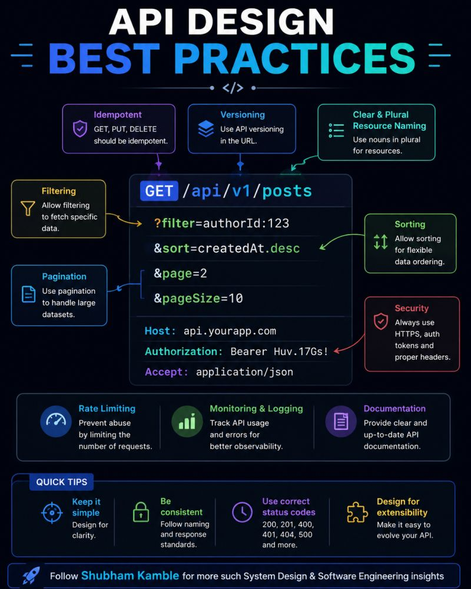

✅ Use versioning (/api/v1/users)
✅ Keep resource names clear (/users, /orders)
✅ Support filtering & sorting
✅ Add pagination for large datasets
✅ Make APIs secure with auth & HTTPS
✅ Implement rate limiting to prevent abuse
✅ Enable logging & monitoring for debugging
✅ Maintain good documentation

