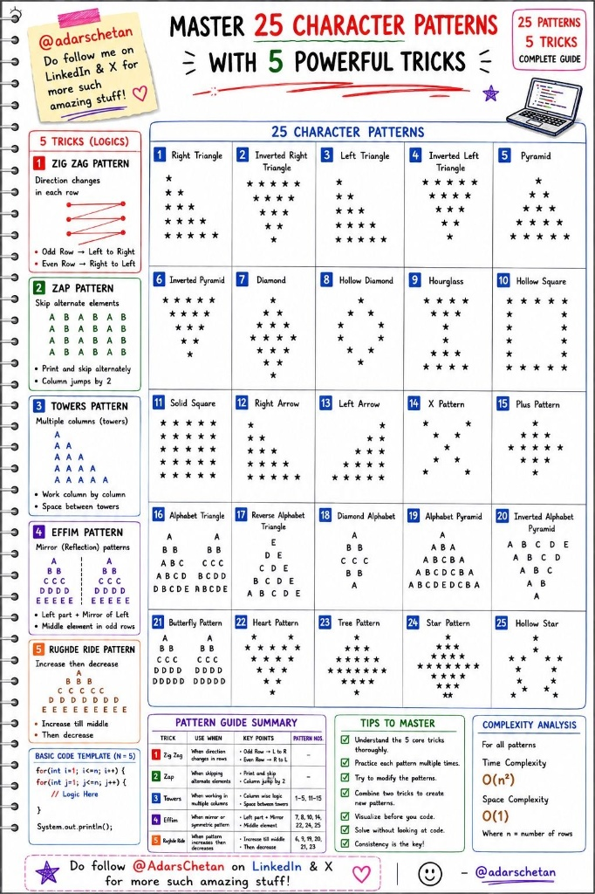

```js
function rightTriangle(n) {
    for (let i = 1; i <= n; i++) {
        // Repeat the star string 'i' times
        let row = "* ".repeat(i);
        console.log(row.trim());
    }
}

rightTriangle(5);

function pyramid(n) {
    for (let i = 1; i <= n; i++) {
        // Calculate spaces and stars
        let spaces = " ".repeat(n - i);
        let stars = "* ".repeat(i);
        console.log(spaces + stars.trim());
    }
}

pyramid(5);

function diamond(n) {
    // Top half (Pyramid)
    for (let i = 1; i <= n; i++) {
        let spaces = " ".repeat(n - i);
        let stars = "* ".repeat(i);
        console.log(spaces + stars.trim());
    }
    // Bottom half (Inverted Pyramid)
    for (let i = n - 1; i >= 1; i--) {
        let spaces = " ".repeat(n - i);
        let stars = "* ".repeat(i);
        console.log(spaces + stars.trim());
    }
}

diamond(5);

/**
 * 25 CHARACTER PATTERNS IN JAVASCRIPT
 * Set N = 5 for standard testing
 */
const n = 5;

// ==========================================
// 1. BASIC TRIANGLES
// ==========================================

console.log("1. Right Triangle");
for (let i = 1; i <= n; i++) {
    console.log("* ".repeat(i)
        .trim());
}

console.log("\n2. Inverted Right Triangle");
for (let i = n; i >= 1; i--) {
    console.log("* ".repeat(i)
        .trim());
}

console.log("\n3. Left Triangle");
for (let i = 1; i <= n; i++) {
    console.log("  ".repeat(n - i) + "* ".repeat(i)
        .trimEnd());
}

console.log("\n4. Inverted Left Triangle");
for (let i = n; i >= 1; i--) {
    console.log("  ".repeat(n - i) + "* ".repeat(i)
        .trimEnd());
}

// ==========================================
// 2. PYRAMIDS & DIAMONDS
// ==========================================

console.log("\n5. Pyramid");
for (let i = 1; i <= n; i++) {
    console.log(" ".repeat(n - i) + "* ".repeat(i)
        .trimEnd());
}

console.log("\n6. Inverted Pyramid");
for (let i = n; i >= 1; i--) {
    console.log(" ".repeat(n - i) + "* ".repeat(i)
        .trimEnd());
}

console.log("\n7. Diamond");
for (let i = 1; i <= n; i++)
    console.log(" ".repeat(n - i) + "* ".repeat(i)
        .trimEnd());
for (let i = n - 1; i >= 1; i--)
    console.log(" ".repeat(n - i) + "* ".repeat(i)
        .trimEnd());

console.log("\n8. Hollow Diamond");
for (let i = 1; i <= n; i++) {
    let row = " ".repeat(n - i) + "*";
    if (i > 1) row += " ".repeat((i - 1) * 2 - 1) + "*";
    console.log(row);
}
for (let i = n - 1; i >= 1; i--) {
    let row = " ".repeat(n - i) + "*";
    if (i > 1) row += " ".repeat((i - 1) * 2 - 1) + "*";
    console.log(row);
}

console.log("\n9. Hourglass");
for (let i = n; i >= 1; i--)
    console.log(" ".repeat(n - i) + "* ".repeat(i)
        .trimEnd());
for (let i = 2; i <= n; i++)
    console.log(" ".repeat(n - i) + "* ".repeat(i)
        .trimEnd());

// ==========================================
// 3. SQUARES & ARROWS
// ==========================================

console.log("\n10. Hollow Square");
for (let i = 1; i <= n; i++) {
    if (i === 1 || i === n) console.log("* ".repeat(n)
        .trim());
    else console.log("*" + "  ".repeat(n - 2) + " *");
}

console.log("\n11. Solid Square");
for (let i = 1; i <= n; i++) {
    console.log("* ".repeat(n)
        .trim());
}

console.log("\n12. Right Arrow");
for (let i = 1; i <= n; i++) console.log("* ".repeat(i)
    .trim());
for (let i = n - 1; i >= 1; i--) console.log("* ".repeat(i)
    .trim());

console.log("\n13. Left Arrow");
for (let i = 1; i <= n; i++)
    console.log("  ".repeat(n - i) + "* ".repeat(i)
        .trimEnd());
for (let i = n - 1; i >= 1; i--)
    console.log("  ".repeat(n - i) + "* ".repeat(i)
        .trimEnd());

console.log("\n14. X Pattern");
for (let i = 0; i < n; i++) {
    let row = "";
    for (let j = 0; j < n; j++) {
        if (j === i || j === n - 1 - i) row += "*";
        else row += " ";
    }
    console.log(row);
}

console.log("\n15. Plus Pattern");
for (let i = 0; i < n; i++) {
    let row = "";
    for (let j = 0; j < n; j++) {
        if (i === Math.floor(n / 2) || j === Math.floor(n / 2)) row += "* ";
        else row += "  ";
    }
    console.log(row.trimEnd());
}

// ==========================================
// 4. ALPHABET PATTERNS
// ==========================================
const alpha = "ABCDEFGHIJKLMNOPQRSTUVWXYZ";

console.log("\n16. Alphabet Triangle");
for (let i = 1; i <= n; i++) {
    let row = "";
    for (let j = 0; j < i; j++) row += alpha[j] + " ";
    console.log(row.trim());
}

console.log("\n17. Reverse Alphabet Triangle");
for (let i = 1; i <= n; i++) {
    let row = "";
    for (let j = n - i; j < n; j++) row += alpha[j] + " ";
    console.log(row.trim());
}

console.log("\n18. Diamond Alphabet");
for (let i = 1; i <= n; i++)
    console.log(" ".repeat(n - i) + (alpha[i - 1] + " ")
        .repeat(i)
        .trimEnd());
for (let i = n - 1; i >= 1; i--)
    console.log(" ".repeat(n - i) + (alpha[i - 1] + " ")
        .repeat(i)
        .trimEnd());

console.log("\n19. Alphabet Pyramid");
for (let i = 1; i <= n; i++) {
    let row = " ".repeat(n - i);
    for (let j = 0; j < i; j++) row += alpha[j];
    for (let j = i - 2; j >= 0; j--) row += alpha[j];
    console.log(row);
}

console.log("\n20. Inverted Alphabet Pyramid");
for (let i = n; i >= 1; i--) {
    let row = " ".repeat(n - i);
    for (let j = 0; j < i; j++) row += alpha[j] + " ";
    console.log(row.trimEnd());
}

// ==========================================
// 5. SPECIAL & COMPLEX PATTERNS
// ==========================================

console.log("\n21. Butterfly Pattern");
for (let i = 1; i <= n; i++) {
    console.log("*".repeat(i) + " ".repeat((n - i) * 2) + "*".repeat(i));
}
for (let i = n - 1; i >= 1; i--) {
    console.log("*".repeat(i) + " ".repeat((n - i) * 2) + "*".repeat(i));
}

console.log("\n22. Heart Pattern");
for (let i = Math.floor(n / 2); i <= n; i += 2) {
    console.log(
        " ".repeat((n - i) / 2) + "*".repeat(i) + " ".repeat(n - i) + "*".repeat(i)
    , );
}
for (let i = n; i >= 1; i--) {
    console.log(" ".repeat(n - i) + "*".repeat(i * 2 - 1));
}

console.log("\n23. Tree Pattern");
for (let i = 1; i <= n; i++) {
    console.log(" ".repeat(n - i) + "* ".repeat(i)
        .trimEnd());
}
// Trunk
for (let i = 0; i < 2; i++) {
    console.log(" ".repeat(n - 2) + "***");
}

console.log("\n24. Star Pattern (Rhombus/Diamond variation)");
for (let i = 1; i <= n; i++)
    console.log(" ".repeat(n - i) + "*".repeat(i * 2 - 1));
for (let i = n - 1; i >= 1; i--)
    console.log(" ".repeat(n - i) + "*".repeat(i * 2 - 1));

console.log("\n25. Hollow Star");
for (let i = 1; i <= n; i++) {
    let row = " ".repeat(n - i) + "*";
    if (i > 1) row += " ".repeat((i - 1) * 2 - 1) + "*";
    console.log(row);
}
for (let i = n - 1; i >= 1; i--) {
    let row = " ".repeat(n - i) + "*";
    if (i > 1) row += " ".repeat((i - 1) * 2 - 1) + "*";
    console.log(row);
}
```
