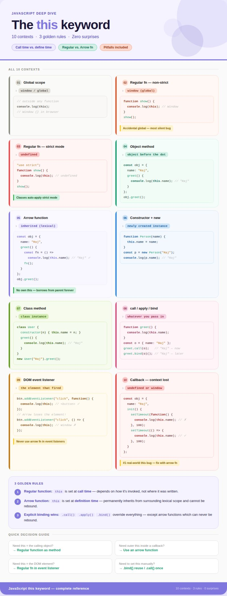

1. Global Context Outside any function, this refers to the global object window in browsers, global in js.
2. Regular Function (non-strict mode) this refers to the global object (window), even though you're inside a function.
3. Regular Function (strict mode) this is undefined. JavaScript stops the accidental global binding.
4. Object Method When a function is called as a property of an object, this refers to that object.
5. Arrow Function Doesn't have its own this. It inherits this from the surrounding lexical scope wherever the arrow function was written, not called.
6. Constructor Function / new keyword this refers to the newly created object being built.
7. Class Method Same as object method this refers to the instance of the class.
8. call(), apply(), bind() You manually set what this should be. These are the escape hatches.
9. Event Listeners (DOM) this refers to the HTML element that triggered the event but only with regular functions, not arrow functions.
10. Callback Functions this is often lost here. Passing a method as a callback detaches it from its original object.

