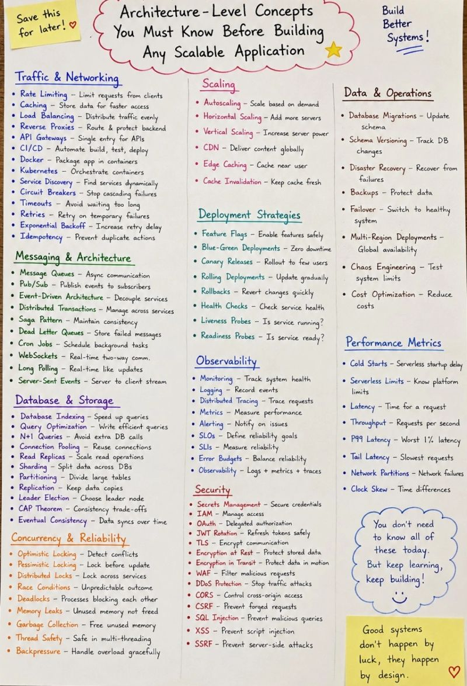

𝗗𝗮𝘁𝗮𝗯𝗮𝘀𝗲
6. Database connection pools are exhausted in production. How would you investigate and fix the issue?
7. A MongoDB query that was fast yesterday is now taking several seconds. What would you check?
8. Production database CPU suddenly reaches 90%. How would you perform root-cause analysis?
9. How would you identify and fix N+1 query problems?
10. What database optimization techniques have you used in high-traffic systems?

𝗖𝗮𝗰𝗵𝗶𝗻𝗴
11. Users are seeing stale data after updates while Redis caching is enabled. What could be wrong?
12. How would you design cache invalidation for frequently updated data?
13. When should you avoid using caching?

 𝗠𝗶𝗰𝗿𝗼𝘀𝗲𝗿𝘃𝗶𝗰𝗲𝘀
14. Service A depends on Service B, and Service B is down. How would you prevent Service A from failing?
15. What is a Circuit Breaker, and where have you used it?
16. How do you prevent cascading failures between microservices?
17. How do you handle retries and timeouts when calling external services?

 𝗠𝗲𝘀𝘀𝗮𝗴𝗶𝗻𝗴 & 𝗤𝘂𝗲𝘂𝗲𝘀
18. Why should email sending or notification processing be moved to a queue?
19. A queue backlog keeps increasing. How would you investigate?
20. What is a Dead Letter Queue (DLQ), and why is it important?
21. How do you prevent duplicate message processing?

 𝗠𝗲𝗺𝗼𝗿𝘆 & 𝗗𝗲𝗯𝘂𝗴𝗴𝗶𝗻𝗴
22. A Node.js application's memory usage keeps increasing and eventually crashes. How would you debug it?
23. How do you identify memory leaks in production?
24. What tools have you used for heap analysis and performance troubleshooting?

 𝗦𝗲𝗰𝘂𝗿𝗶𝘁𝘆
25. How would you secure a Node.js API running in production?
26. How do you prevent brute-force attacks on login APIs?
27. How do you protect against SQL Injection and NoSQL Injection attacks?
28. How do you securely manage secrets, API keys, and database credentials?

 𝗠𝗼𝗻𝗶𝘁𝗼𝗿𝗶𝗻𝗴 & 𝗟𝗼𝗴𝗴𝗶𝗻𝗴
29. A production issue occurred at 2 AM. How would you investigate it?
30. What metrics should every Node.js application expose?
31. How would you implement centralized logging in a microservices architecture?
32. What alerts would you configure for a critical production service?

• How would you prevent API abuse? → Rate Limiting

• How would you reduce response time? → Caching, CDN, Edge Caching

• How would you handle millions of requests? → Load Balancer, Autoscaling, Horizontal Scaling

• What happens if one service goes down? → Circuit Breaker, Retries, Timeouts

• How do microservices communicate? → Message Queues, Pub/Sub, Event-Driven Architecture

• How do you keep distributed data consistent? → Saga Pattern, Distributed Transactions, Eventual Consistency

• How do you scale databases? → Indexing, Read Replicas, Sharding, Partitioning, Replication

• How do you avoid duplicate payments? → Idempotency

• How do you handle concurrent updates? → Optimistic Locking, Pessimistic Locking, Distributed Locks

• How do you deploy without downtime? → Blue-Green, Canary, Rolling Deployments, Rollbacks

• How do you know production is healthy? → Monitoring, Logging, Metrics, Distributed Tracing, Alerting

• How do you secure your APIs? → OAuth, JWT Rotation, IAM, TLS, WAF, CORS, CSRF, XSS, SQL Injection, SSRF

• How do you recover from failures? → Backups, Disaster Recovery, Failover, Multi-Region Deployment

• How do you measure performance? → Latency, Throughput, P99 Latency, Tail Latency

Here are some of the topics every Senior React + Node.js developer should prepare:

✅ Load Balancing & Scalability

* How does a load balancer work?
* Layer 4 vs Layer 7 load balancing
* Stateless vs stateful applications
* Sticky sessions—when should you use them?
* Scaling Node.js applications horizontally
* WebSockets behind a load balancer
* Reverse proxy (Nginx) and API Gateway concepts

✅ Error Handling

* Designing a centralized error handling strategy
* Standard API error response structure
* Handling async errors in Express/Fastify
* Validation vs business vs system exceptions
* Logging errors without exposing sensitive information
* Global React error handling using Error Boundaries

✅ Production Backend (Node.js)

* JWT/OAuth authentication
* Authorization (RBAC)
* Structured logging & correlation IDs
* Health checks
* Graceful shutdown
* Rate limiting
* Redis caching
* Message queues (RabbitMQ/Kafka)
* Database transactions
* Connection pooling
* API versioning
* Swagger/OpenAPI
* Monitoring & observability
* Performance optimization
* Security best practices (Helmet, CORS, input validation)

✅ Production Frontend (React)

* React performance optimization
* React.memo, useMemo & useCallback
* Code splitting & lazy loading
* Suspense & Error Boundaries
* State management (Redux Toolkit, Zustand, Context API)
* React Query/RTK Query
* Authentication flow
* Protected routes
* Optimistic UI updates
* Virtualization for large lists
* Accessibility (a11y)
* Micro Frontends (basic understanding)

✅ Real-World Development & Maintenance

* How do you debug production issues?
* How do you investigate slow APIs?
* What would you monitor in production?
* How do you deploy with zero downtime?
* How do you handle backward compatibility?
* How do you migrate legacy applications?
* How do you identify memory leaks in React and Node.js?
* What is your incident response process?
* How do you conduct effective code reviews?
* How do you improve application performance after release

✅ Load Balancing

* How does a load balancer distribute traffic?
* What is the difference between Layer 4 and Layer 7 load balancing?
* Sticky sessions vs stateless applications.
* How do WebSockets work behind a load balancer?
* How would you scale a NestJS application horizontally?

✅ Error Handling

* How do you implement centralized exception handling in NestJS?
* What should the standard API error response look like?
* How do you handle validation errors consistently?
* How do you differentiate between business, validation, and system errors?
* How do you ensure sensitive information never reaches the client?

✅ Production Backend (NestJS)

* Authentication & Authorization (JWT/OAuth/Auth0)
* Logging with correlation IDs
* Health checks & readiness/liveness probes
* Graceful shutdown
* Request validation
* Rate limiting
* Caching with Redis
* Background jobs & queues
* API versioning
* Swagger/OpenAPI
* Monitoring & metrics
* Database transactions
* Connection pooling
* Performance optimization

✅ Production Frontend (Angular)

* Lazy loading & standalone components
* Route guards & interceptors
* State management (Signals/NgRx)
* Performance optimization
* Memory leak prevention
* Change detection strategies
* Error boundaries & global error handling
* HTTP retry strategies
* Authentication flow
* Role-based access
* Feature flags
* Environment configuration

✅ Real-World Maintenance Questions

* How do you debug production issues with limited logs?
* How do you safely deploy without downtime?
* How do you investigate a sudden spike in API latency?
* How do you handle backward compatibility?
* What happens when one microservice is unavailable?
* How do you migrate a legacy application with minimal risk?
* How do you identify and fix memory leaks?
* What would you monitor in production?
* How do you handle incidents and root cause analysis?
* What is your code review approach for junior developers?

. How would you stream an AI response from Node.js to Angular or React?
2. What is the difference between Server-Sent Events, WebSockets, and a normal HTTP response?
3. How would you display streamed text gradually on the frontend?
4. How would you implement a “Stop Generating” button?
5. How would you cancel an AI request using AbortController?
6. How would you handle an interrupted or incomplete streaming response?
7. Which HTTP status codes can an AI-enabled API return?
8. How would you handle a 400 Bad Request response?
9. What should the application do when it receives a 401 or 403 response?
10. What does a 429 response mean in an AI application?
11. How would you handle rate-limit and quota errors?
12. What is exponential backoff, and when should it be used?
13. How would you handle 500, 502, 503, and 504 errors?
14. Why should API keys never be exposed in Angular or React code?
15. How would you protect an AI endpoint using authentication, authorization, and rate limiting?

1️⃣ You have a large legacy React application built with class components. How would you migrate it to functional components and hooks incrementally?

2️⃣ Would you recommend a complete rewrite or gradual modernization? What factors would influence your decision?

3️⃣ How would you apply the Strangler Fig Pattern to a frontend application?

4️⃣ How would you allow legacy and modern React modules to coexist during the migration?

5️⃣ How would you identify feature boundaries before breaking a large monolithic frontend into independently maintainable modules?

6️⃣ How would you migrate lifecycle methods such as componentDidMount, componentDidUpdate and componentWillUnmount to hooks?

7️⃣ What problems can occur when replacing lifecycle methods with useEffect?

8️⃣ How would you prevent infinite renders, stale closures and incorrect effect dependencies?

9️⃣ How would you migrate legacy state management based on prop drilling, global variables or event emitters?

🔟 When would you choose Context API, Redux Toolkit, Zustand or server-state libraries?

1️⃣1️⃣ How would you separate client state from server state during modernization?

Here are some practical interview questions for senior Node.js and NestJS developers:

1️⃣ You have a large legacy Node.js application built with Express.js. How would you migrate it to NestJS without rewriting everything at once?

2️⃣ Would you choose a complete rewrite or an incremental migration? What factors would influence your decision?

3️⃣ How would you use the Strangler Fig Pattern to gradually replace legacy modules?

4️⃣ How would you identify module boundaries when converting a monolithic application into NestJS modules or microservices?

5️⃣ How would you reuse existing Express middleware inside a NestJS application?

6️⃣ How would you migrate legacy authentication and authorization to NestJS Guards, Passport strategies and role-based access control?

7️⃣ How would you replace scattered validation logic with DTOs, ValidationPipe and class-validator?

8️⃣ How would you introduce dependency injection when the legacy codebase relies heavily on global objects and tightly coupled services?

9️⃣ How would you migrate database access from raw SQL or an older ORM to Prisma, TypeORM or another modern solution?

🔟 How would you maintain backward compatibility for existing API consumers during the migration?

1️⃣1️⃣ How would you version APIs while old and new endpoints operate simultaneously?

1️⃣2️⃣ How would you migrate scheduled jobs, queues and background processes to BullMQ or a message-driven architecture?

1️⃣3️⃣ How would you prevent duplicate processing while migrating events between the legacy and modern systems?
