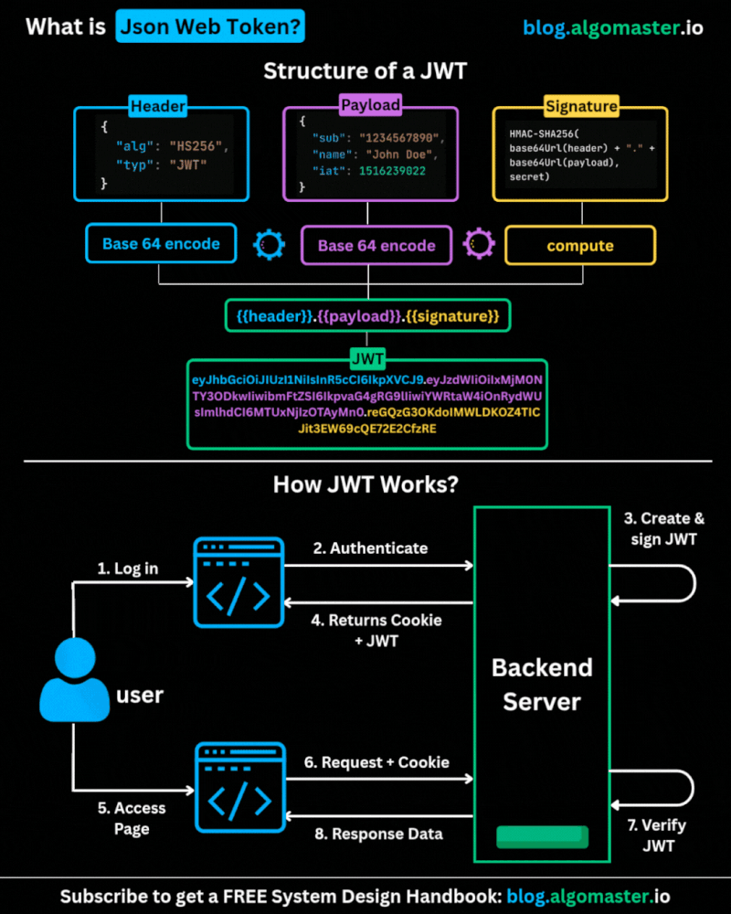

  
𝗪𝗵𝗮𝘁 𝗶𝘀 𝗝𝗪𝗧 𝗮𝗻𝗱 𝗛𝗼𝘄 𝗗𝗼𝗲𝘀 𝗜𝘁 𝗪𝗼𝗿𝗸?

JWT (JSON Web Token) is a compact, URL-safe token used to securely transmit information between a client and server — a cornerstone of modern web authentication.

𝗔 𝗝𝗪𝗧 𝗰𝗼𝗻𝘀𝗶𝘀𝘁𝘀 𝗼𝗳 𝘁𝗵𝗿𝗲𝗲 𝗽𝗮𝗿𝘁𝘀, 𝘀𝗲𝗽𝗮𝗿𝗮𝘁𝗲𝗱 𝗯𝘆 𝗱𝗼𝘁𝘀 (𝘅𝘅𝘅𝘅𝘅.𝘆𝘆𝘆𝘆𝘆.𝘇𝘇𝘇𝘇𝘇):

 1. Header: Specifies the signing algorithm (e.g., HMAC SHA256 or RSA) and token type.
 2. Payload: Contains "claims" — statements about the user and any additional metadata.
 3. Signature: Ensures the token hasn’t been tampered with. It's generated using the encoded header, payload, a secret key, and the algorithm.

𝗛𝗼𝘄 𝗜𝘁 𝗪𝗼𝗿𝗸𝘀:

 • User logs in with credentials.
 • Server validates and issues a signed JWT.
 • Client stores the token (usually in localStorage or cookies).
 • On future requests, the token is sent via the Authorization header.

✅ 𝗪𝗵𝘆 𝗝𝗪𝗧?

 • Stateless: No need for server-side session storage — ideal for scalable APIs.
 • Secure: Signed to prevent tampering.
 • Compact: Lightweight and efficient for transmission.

