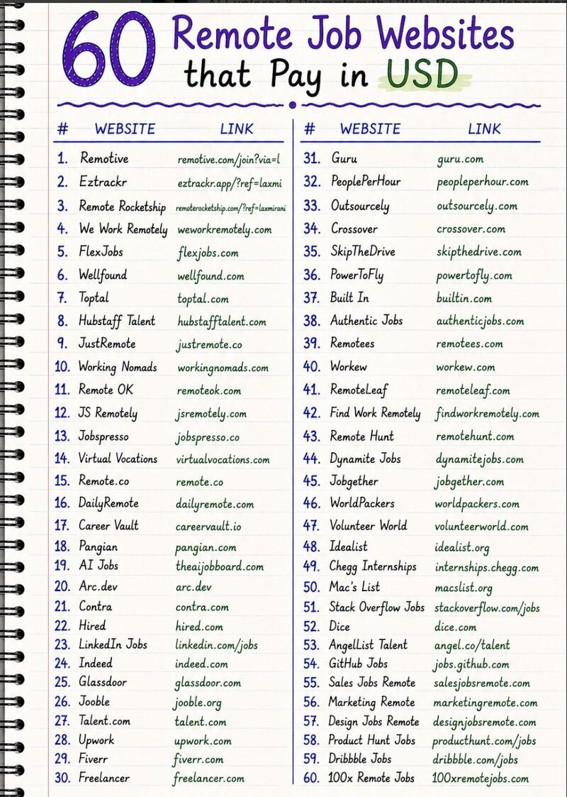

-Remotive (<https://lnkd.in/gAkPuGXp>)
-Eztrackr (<https://lnkd.in/dG9aanMm>)
-Remote Rocketship (<https://lnkd.in/g-AzcyQ3>)
-Toptal (toptal.com)
-Skip The Drive (<https://lnkd.in/gAkPuGXp>)
-NoDesk (nodesk.co)
-RemoteHabits (remotehabits.com)
-Remote4Me (remote4me.com)
-Pangian (pangian.com)
-Remotees (remotees.com)
-justremote (justremote.co)
-Remotecrew (remotecrew.io)
-Europe Remotely (europeremotely.com)
-Remote OK Europe (remoteok.io/europe)
-Remote of Asia (remoteok.io/asia)
-FlexJobs (flexjobs.com)
-Remote (remote.co)
-We Work Remotely (weworkremotely.com)
-Remote OK (remoteok.com)
-AngelList (angel.co)
-LinkedIn (linkedin.com)
-Upwork (upwork.com)
-Freelancer (freelancer.com)
-Working Nomads (workingnomads.com)
-SimplyHired (simplyhired.com)
-Jobspresso (jobspresso.co)
-Virtual Vocations (virtualvocations.com)
-Stack Overflow Jobs (stackoverflow.com/jobs)
-Outsourcely (outsourcely.com)

1. Like and Repost (It will be useful for others)
2. For job Updates and Materials:
WhatsApp Group: <https://lnkd.in/gfa8X8WW>
Telegram group: <https://lnkd.in/gncHsybi>
WhatsApp channel: <https://lnkd.in/gA584iii>

Kindly #reshare with your friends it is helpful for others💯

Resume Making:🎯

1. Canva - canva.com
2. Resume Genius - resumegenius.com
3. Zety - zety.com
4. Novoresume - novoresume.com
5. Resume.com - resume.com
6. VisualCV - visualcv.com
7. Enhancv - enhancv.com
8. Resume.io - resume.io
9. My Perfect Resume - myperfectresume.com
10. SlashCV - slashcv.com

Interview Preparation📚

1. InterviewBit - interviewbit.com
2. Glassdoor - glassdoor.com
3. Interviewing.io - interviewing.io
4. Jobscan Interview Prep - jobscan.co/interview
5. Indeed Interview Tips - indeed.com/career-advice
6. CareerCup - careercup.com
7. The Muse - themuse.com
8. PrepLounge - preplounge.com
9. Big Interview - biginterview.com
10. LinkedIn Learning - linkedin.com/learning

Remotely Hiring Sites📢🚀

1. SimplyHired (simplyhired.com)
2. Toptal (toptal.com)
3. Stack Overflow Jobs (stackoverflow.com)
4. Outsourcely (outsourcely.com)
5. Jobspresso (jobspresso.co)
6. Linkedin (<https://in.linkedin.com>)
7. NoDesk (nodesk.co)
8. RemoteHabits (remotehabits.com)
9. Remotive (remotive.com)
10. Remote4Me (remote4me.com)
11. Pangian (pangian.com)
12. Remotees (remotees.com)
13. Europe Remotely (europeremotely.com)
14. Remote OK Europe (<https://lnkd.in/gr4C-mjp>)
15. Remote of Asia (<https://lnkd.in/ghrA_z9u>)
16. FlexJobs (flexjobs.com)
17. Remote.co (remote.co)
18. We Work Remotely (weworkremotely.com)
19. RemoteOK (remoteok.com)
20. AngelList (angel.co)
21. Linkedin (linkedin.com)
22. Upwork (upwork.com)
23. Freelancer (freelancer.com)
24. Working Nomads (workingnomads.com)
25. Virtual Vocations (virtualvocations.com)
26. Wellfound (<https://wellfound.com>)
27.Remote freelance (remotefreelance.com)
27. Remote rocketship (<https://lnkd.in/gS2nRtV3>)

60 Remote Job Websites That Pay in USD

Finding legitimate remote jobs doesn't have to be difficult.

I've compiled 60 trusted websites where you can find remote opportunities from companies worldwide and get paid in USD.

Whether you're a student, freelancer, developer, designer, marketer, or job seeker, save this list you'll thank yourself later.

Remote work is here to stay, and if I had to find a high-paying remote job today, these are the platforms I’d start with:

1. Remotive

- Curates active, fully remote tech jobs
- Trusted by top global tech companies
- Link: <https://lnkd.in/gGV9EC8h>

1. Remote Rocketship

- Insights into flexible jobs and company culture.
- Free resource for companies looking for remote talent
- Connects businesses with freelancers and agencies worldwide
- Link: <https://lnkd.in/gMgvEmhW>]

1. Eztrackr
→ Build your resume. Track your job applications. Get your dream job faster.
→ One platform for your entire job search
→ 1M+ resumes made
→ Get started here: <https://lnkd.in/gu6tQN8R>

