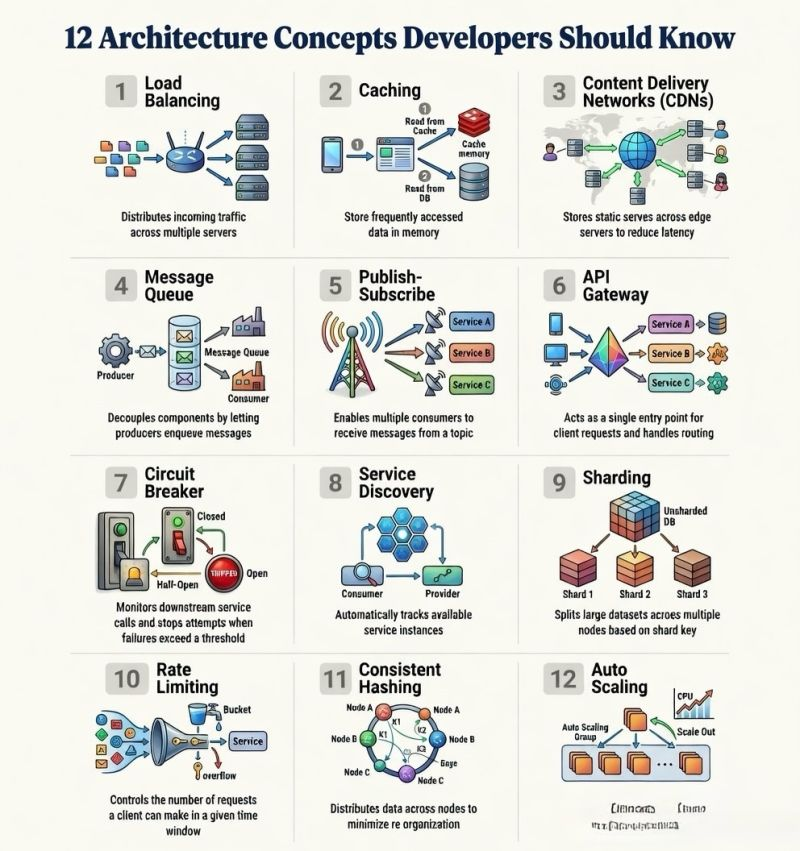

1️⃣ Load Balancing - Distribute incoming traffic across multiple servers to improve reliability and performance.
2️⃣ Caching -Store frequently accessed data in memory to reduce latency.
3️⃣ CDN (Content Delivery Network) -Deliver static content from edge locations closer to users.
4️⃣ Message Queues -Enable asynchronous communication and decouple services.
5️⃣ Publish–Subscribe (Pub/Sub) - Allow multiple consumers to react to events.
6️⃣ API Gateway - Single entry point for routing, authentication, and monitoring.
7️⃣ Circuit Breaker - Prevent cascading failures in distributed systems.
8️⃣ Service Discovery -Automatically track and connect service instances.
9️⃣ Sharding - Split large datasets across multiple databases.
🔟 Rate Limiting - Protect services from abuse or overload.
1️⃣1️⃣ Consistent Hashing - Efficient data distribution with minimal reshuffling.
1️⃣2️⃣ Auto Scaling - Dynamically adjust resources based on traffic.

