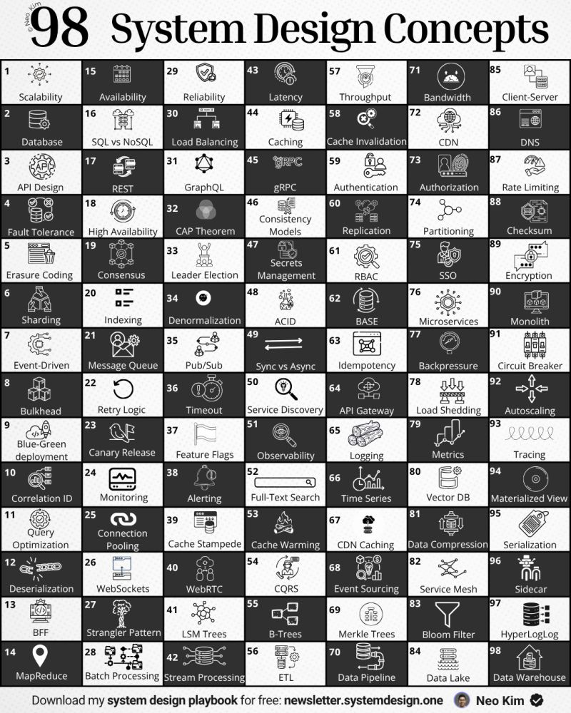

[system-design-academy
Public](https://github.com/systemdesign42/system-design-academy)

System Design Key Concepts:

1. Scalability: <https://lnkd.in/gpge_z76>
2. Latency vs Throughput: <https://lnkd.in/g_amhAtN>
3. CAP: <https://lnkd.in/g3hmVamx>
4. ACID Transactions: <https://lnkd.in/gMe2JqaF>
5. Rate Limiting: <https://lnkd.in/gWsTDR3m>
6. API Design: <https://lnkd.in/ghYzrr8q>
7. Strong vs Eventual Consistency: <https://lnkd.in/gJ-uXQXZ>
8. Distributed Tracing: <https://lnkd.in/d6r5RdXG>
9. Synchronous vs. asynchronous communications: <https://lnkd.in/gC3F2nvr>
10. Batch Processing vs Stream Processing: <https://lnkd.in/g4_MzM4s>
11. Fault Tolerance: <https://lnkd.in/dVJ6n3wA>

➤ System Design Building Blocks:

1. Database: <https://lnkd.in/gti8gjpz>
2. Horizontal vs Vertical Scaling: <https://lnkd.in/gAH2e9du>
3. Caching: <https://lnkd.in/gC9piQbJ>
4. Distributed Caching: <https://lnkd.in/g7WKydNg>
5. Load Balancing: <https://lnkd.in/gQaa8sXK>
6. SQL vs NoSQL: <https://lnkd.in/g3WC_yxn>
7. Database Scaling: <https://lnkd.in/gAXpSyWQ>
8. Data Replication: <https://lnkd.in/gVAJxTpS>
9. Data Redundancy: <https://lnkd.in/gNN7TF7n>
10. Database Sharding: <https://lnkd.in/gMqqc6x9>
11. Database Index's: <https://lnkd.in/gCeshYVt>
12. Proxy Server: <https://lnkd.in/gi8KnKS6>
13. WebSocket: <https://lnkd.in/g76Gv2KQ>
14. API Gateway: <https://lnkd.in/gnsJGJaM>
15. Message Queues: <https://lnkd.in/gTzY6uk8>

➤ System Design Architectural Patterns:

1. Event-Driven Architecture: <https://lnkd.in/dp8CPvey>
2. Client-Server Architecture: <https://lnkd.in/dAARQYzq>
3. Serverless Architecture: <https://lnkd.in/gQNAXKkb>
4. Microservices Architecture: <https://lnkd.in/gFXUrz_T>

➤ Low-Level Design Problems:

1. Design Parking Lot: <https://lnkd.in/dQaAuFd2>
2. Design Splitwise: <https://lnkd.in/dF5fBnex>
3. Design Chess Validator: <https://lnkd.in/dfAQHvN4>
4. Design Distributed Queue | Kafka: <https://lnkd.in/dQ6_B4_M>

➤ System Design and Architecture (HLD):

1. Design Unique ID Generator Service
2. Design bitly
3. Design Whatsapp
4. Design Insta/Twitter News Feed
5. Design Search Autocomplete

 Part 1: <https://lnkd.in/eK87NkE5>
→ Part 2: <https://lnkd.in/dicBp9N4>
→ Part 3: <https://lnkd.in/dDKk3-Xw>

<https://github.com/priya42bagde/frontend-system-design>

𝐒𝐲𝐬𝐭𝐞𝐦 𝐃𝐞𝐬𝐢𝐠𝐧 𝐈𝐧𝐭𝐞𝐫𝐯𝐢𝐞𝐰 𝐓𝐢𝐩𝐬 ! #part1

1. Understand the 𝐟𝐮𝐧𝐜𝐭𝐢𝐨𝐧𝐚𝐥 𝐚𝐧𝐝 𝐧𝐨𝐧-𝐟𝐮𝐧𝐜𝐭𝐢𝐨𝐧𝐚𝐥 requirements before designing.
2. Clearly define the 𝐮𝐬𝐞 𝐜𝐚𝐬𝐞𝐬 𝐚𝐧𝐝 𝐜𝐨𝐧𝐬𝐭𝐫𝐚𝐢𝐧𝐭𝐬 of the system.
3. There is no perfect solution. It’s all about 𝐭𝐫𝐚𝐝𝐞𝐨𝐟𝐟𝐬.
4. Assume everything can and will fail. Make it 𝐟𝐚𝐮𝐥𝐭 𝐭𝐨𝐥𝐞𝐫𝐚𝐧𝐭.
5. Keep it 𝐬𝐢𝐦𝐩𝐥𝐞. Avoid over-engineering.
6. Design your system for 𝐬𝐜𝐚𝐥𝐚𝐛𝐢𝐥𝐢𝐭𝐲 from the groundup.
7. Prefer 𝐡𝐨𝐫𝐢𝐳𝐨𝐧𝐭𝐚𝐥 𝐬𝐜𝐚𝐥𝐢𝐧𝐠 over vertical scaling for scalability.
8. Use 𝐋𝐨𝐚𝐝 𝐁𝐚𝐥𝐚𝐧𝐜𝐞𝐫𝐬 to ensure high availability and distribute traffic.
9. Consider using 𝐒𝐐𝐋 Databases for structured data and ACID transactions.
10. Opt for 𝐍𝐨𝐒𝐐𝐋 Databases when dealing with unstructured data.
11. Consider using a 𝐠𝐫𝐚𝐩𝐡 database for highly connected data.
12. Use Database 𝐒𝐡𝐚𝐫𝐝𝐢𝐧𝐠 to scale SQL databases horizontally.
13. Use Database 𝐈𝐧𝐝𝐞𝐱𝐢𝐧𝐠 to optimize the read queries in databases.
14. Assume everything can and will fail. Make it 𝐟𝐚𝐮𝐥𝐭 𝐭𝐨𝐥𝐞𝐫𝐚𝐧𝐭.
15. Use 𝐑𝐚𝐭𝐞 𝐋𝐢𝐦𝐢𝐭𝐢𝐧𝐠 to prevent system from overload and DOS attacks.
16. Consider using 𝐖𝐞𝐛𝐒𝐨𝐜𝐤𝐞𝐭𝐬 for real-time communication.
17. Use 𝐇𝐞𝐚𝐫𝐭𝐛𝐞𝐚𝐭 Mechanisms to detect failures.
18. Consider using a 𝐦𝐞𝐬𝐬𝐚𝐠𝐞 𝐪𝐮𝐞𝐮𝐞 for asynchronous communication.
19. Implement data 𝐩𝐚𝐫𝐭𝐢𝐭𝐢𝐨𝐧𝐢𝐧𝐠 𝐚𝐧𝐝 𝐬𝐡𝐚𝐫𝐝𝐢𝐧𝐠 for large datasets.
20. Consider 𝐝𝐞𝐧𝐨𝐫𝐦𝐚𝐥𝐢𝐳𝐢𝐧𝐠 databases for read-heavy workloads.
21. Use 𝐛𝐥𝐨𝐨𝐦 𝐟𝐢𝐥𝐭𝐞𝐫𝐬 to check for an item in a large dataset quickly.
22. Use 𝐂𝐃𝐍𝐬 to reduce latency for a global userbase.
23. Use 𝐜𝐚𝐜𝐡𝐢𝐧𝐠 to reduce load on the database and improve response times.
24. Use 𝐰𝐫𝐢𝐭𝐞-𝐭𝐡𝐫𝐨𝐮𝐠𝐡 𝐜𝐚𝐜𝐡𝐞 for write-heavy applications.
25. Use 𝐫𝐞𝐚𝐝-𝐭𝐡𝐫𝐨𝐮𝐠𝐡 𝐜𝐚𝐜𝐡𝐞 for read-heavyvapplications.
26. Use 𝐨𝐛𝐣𝐞𝐜𝐭 𝐬𝐭𝐨𝐫𝐚𝐠𝐞 like S3 for storing large datasets and media files.
27. Implement 𝐃𝐚𝐭𝐚 𝐑𝐞𝐩𝐥𝐢𝐜𝐚𝐭𝐢𝐨𝐧 𝐚𝐧𝐝 𝐑𝐞𝐝𝐮𝐧𝐝𝐚𝐧𝐜𝐲 to avoid single point of failure.
28. Implement 𝐀𝐮𝐭𝐨𝐬𝐜𝐚𝐥𝐢𝐧𝐠 to handle traffic spikes smoothly.
29. Use 𝐀𝐬𝐲𝐧𝐜𝐡𝐫𝐨𝐧𝐨𝐮𝐬 𝐩𝐫𝐨𝐜𝐞𝐬𝐬𝐢𝐧𝐠 for background tasks.
30. Use 𝐛𝐚𝐭𝐜𝐡 𝐩𝐫𝐨𝐜𝐞𝐬𝐬𝐢𝐧𝐠 for non-urgent tasks to optimize resources.
31. Make operations 𝐢𝐝𝐞𝐦𝐩𝐨𝐭𝐞𝐧𝐭 to simplify retry logic and error handling.
32. Consider using a 𝐝𝐚𝐭𝐚 𝐥𝐚𝐤𝐞 or data warehouse for analytics and reporting.
33. Implement comprehensive 𝐥𝐨𝐠𝐠𝐢𝐧𝐠 𝐚𝐧𝐝 𝐦𝐨𝐧𝐢𝐭𝐨𝐫𝐢𝐧𝐠 to track the system’s performance and health.
34. Implement 𝐜𝐢𝐫𝐜𝐮𝐢𝐭 𝐛𝐫𝐞𝐚𝐤𝐞𝐫𝐬 to prevent a single failing service from bringing down the entire system.
35. Implement  𝐜𝐡𝐚𝐨𝐬 𝐞𝐧𝐠𝐢𝐧𝐞𝐞𝐫𝐢𝐧𝐠 practices to test system resilience and find vulnerabilities.
36. Design for 𝐬𝐭𝐚𝐭𝐞𝐥𝐞𝐬𝐬𝐧𝐞𝐬𝐬 when possible to improve scalability and simplify architecture.
37. Use 𝐟𝐚𝐢𝐥𝐨𝐯𝐞𝐫 𝐦𝐞𝐜𝐡𝐚𝐧𝐢𝐬𝐦𝐬 to automatically switchto a redundant system when a failure is detected.
38. Distribute your system across different datacenters to prevent localized failures.
39. Use 𝐓𝐢𝐦𝐞-𝐓𝐨-𝐋𝐢𝐯𝐞 (𝐓𝐓𝐋) values to automatically expire cached data and reduce staleness.
40. 𝐏𝐫𝐞-𝐩𝐨𝐩𝐮𝐥𝐚𝐭𝐞 critical data in the cache to avoid cold starts.

<https://www.youtube.com/playlist?list=PLKhlp2qtUcSaSnNnNffRPIU3DRQ2xAdj8>

Here are 21 system design case studies that will sharpen your thinking:
1️⃣ How WhatsApp Works
↳ <https://lnkd.in/eU2fswMi>
2️⃣ How Amazon S3 Works
↳ <https://lnkd.in/e2p7qXri>
3️⃣ How Uber Finds Nearby Drivers
↳ <https://lnkd.in/eeqH9Hjh>
4️⃣ How Google Docs Works
↳ <https://lnkd.in/ehPNA7Az>
5️⃣ How Spotify Works
↳ <https://lnkd.in/eGbWVeNW>
6️⃣ How URL Shortener Works
↳ <https://lnkd.in/evFTZVQq>
7️⃣ How Kafka Works
↳ <https://lnkd.in/eTtVAjTg>
8️⃣ How YouTube Works
↳ <https://lnkd.in/e7q9F4Sg>
9️⃣ How Reddit Works
↳ <https://lnkd.in/egmm_P7a>
🔟 How Uber Computes ETA
↳ <https://lnkd.in/eVKV2ePC>
1️⃣1️⃣ How Payment Systems Work
↳ <https://lnkd.in/ecVw7jfi>
1️⃣2️⃣ How Slack Works
↳ <https://lnkd.in/eATMDjrK>
1️⃣3️⃣ How Google Search Works
↳ <https://lnkd.in/exsvNqFn>
1️⃣4️⃣ How Tinder Works
↳ <https://lnkd.in/en65fv-W>
1️⃣5️⃣ How Twitter Timeline Works
↳ <https://lnkd.in/eniXMPfU>
1️⃣6️⃣ How Airbnb Works
↳ <https://lnkd.in/dGVfstQM>
1️⃣7️⃣ How Amazon Lambda Works
↳ <https://lnkd.in/eNd3Z5Yn>
1️⃣8️⃣ How Stock Exchange Works
↳ <https://lnkd.in/eNf2QxVZ>
1️⃣9️⃣ How LLMs like ChatGPT Actually Work
↳ <https://lnkd.in/eSd6fS7n>
2️⃣0️⃣ How AirTags Work
↳ <https://lnkd.in/ec75eiCH>
2️⃣1️⃣ How Bluesky Works
↳ <https://lnkd.in/eEhB8V_k>

<https://www.hungryminds.dev/>

𝟭. 𝗛𝗼𝘄 𝘄𝗼𝘂𝗹𝗱 𝘆𝗼𝘂 𝗱𝗲𝘀𝗶𝗴𝗻 𝗮 𝗣𝗮𝗿𝗸𝗶𝗻𝗴 𝗟𝗼𝘁 𝗦𝘆𝘀𝘁𝗲𝗺?

𝟮. 𝗛𝗼𝘄 𝘄𝗼𝘂𝗹𝗱 𝘆𝗼𝘂 𝗱𝗲𝘀𝗶𝗴𝗻 𝗮𝗻 𝗘𝗹𝗲𝘃𝗮𝘁𝗼𝗿 𝗦𝘆𝘀𝘁𝗲𝗺?

𝟯. 𝗛𝗼𝘄 𝘄𝗼𝘂𝗹𝗱 𝘆𝗼𝘂 𝗱𝗲𝘀𝗶𝗴𝗻 𝗮 𝗟𝗶𝗯𝗿𝗮𝗿𝘆 𝗠𝗮𝗻𝗮𝗴𝗲𝗺𝗲𝗻𝘁 𝗦𝘆𝘀𝘁𝗲𝗺?

𝟰. 𝗛𝗼𝘄 𝘄𝗼𝘂𝗹𝗱 𝘆𝗼𝘂 𝗱𝗲𝘀𝗶𝗴𝗻 𝗮 𝗖𝗵𝗲𝘀𝘀 𝗚𝗮𝗺𝗲?

𝟱. 𝗛𝗼𝘄 𝘄𝗼𝘂𝗹𝗱 𝘆𝗼𝘂 𝗱𝗲𝘀𝗶𝗴𝗻 𝗮 𝗠𝗼𝘃𝗶𝗲 𝗧𝗶𝗰𝗸𝗲𝘁 𝗕𝗼𝗼𝗸𝗶𝗻𝗴 𝗦𝘆𝘀𝘁𝗲𝗺?

𝟲. 𝗛𝗼𝘄 𝘄𝗼𝘂𝗹𝗱 𝘆𝗼𝘂 𝗱𝗲𝘀𝗶𝗴𝗻 𝗮𝗻 𝗔𝗧𝗠 𝗦𝘆𝘀𝘁𝗲𝗺?

𝟳. 𝗛𝗼𝘄 𝘄𝗼𝘂𝗹𝗱 𝘆𝗼𝘂 𝗱𝗲𝘀𝗶𝗴𝗻 𝗮 𝗛𝗼𝘁𝗲𝗹 𝗕𝗼𝗼𝗸𝗶𝗻𝗴 𝗦𝘆𝘀𝘁𝗲𝗺?

𝟴. 𝗛𝗼𝘄 𝘄𝗼𝘂𝗹𝗱 𝘆𝗼𝘂 𝗱𝗲𝘀𝗶𝗴𝗻 𝗮 𝗥𝗶𝗱𝗲-𝗦𝗵𝗮𝗿𝗶𝗻𝗴 𝗦𝗲𝗿𝘃𝗶𝗰𝗲 (𝗨𝗯𝗲𝗿/𝗟𝘆𝗳𝘁)?

𝟵. 𝗛𝗼𝘄 𝘄𝗼𝘂𝗹𝗱 𝘆𝗼𝘂 𝗱𝗲𝘀𝗶𝗴𝗻 𝗮 𝗩𝗲𝗻𝗱𝗶𝗻𝗴 𝗠𝗮𝗰𝗵𝗶𝗻𝗲?

𝟭𝟬. 𝗛𝗼𝘄 𝘄𝗼𝘂𝗹𝗱 𝘆𝗼𝘂 𝗱𝗲𝘀𝗶𝗴𝗻 𝗮 𝗦𝗼𝗰𝗶𝗮𝗹 𝗠𝗲𝗱𝗶𝗮 𝗣𝗹𝗮𝘁𝗳𝗼𝗿𝗺 (𝗧𝘄𝗶𝘁𝘁𝗲𝗿/𝗙𝗮𝗰𝗲𝗯𝗼𝗼𝗸)?

𝟭𝟭. 𝗛𝗼𝘄 𝘄𝗼𝘂𝗹𝗱 𝘆𝗼𝘂 𝗱𝗲𝘀𝗶𝗴𝗻 𝗮 𝗙𝗼𝗼𝗱 𝗗𝗲𝗹𝗶𝘃𝗲𝗿𝘆 𝗦𝘆𝘀𝘁𝗲𝗺 (𝗨𝗯𝗲𝗿 𝗘𝗮𝘁𝘀/𝗗𝗼𝗼𝗿𝗗𝗮𝘀𝗵)?

𝟭𝟮. 𝗛𝗼𝘄 𝘄𝗼𝘂𝗹𝗱 𝘆𝗼𝘂 𝗱𝗲𝘀𝗶𝗴𝗻 𝗮𝗻 𝗢𝗻𝗹𝗶𝗻𝗲 𝗦𝗵𝗼𝗽𝗽𝗶𝗻𝗴 𝗦𝘆𝘀𝘁𝗲𝗺 (𝗔𝗺𝗮𝘇𝗼𝗻/𝗙𝗹𝗶𝗽𝗸𝗮𝗿𝘁)?

𝟭𝟯. 𝗛𝗼𝘄 𝘄𝗼𝘂𝗹𝗱 𝘆𝗼𝘂 𝗱𝗲𝘀𝗶𝗴𝗻 𝗮 𝗦𝗻𝗮𝗸𝗲 𝗮𝗻𝗱 𝗟𝗮𝗱𝗱𝗲𝗿 𝗚𝗮𝗺𝗲?

𝟭𝟰. 𝗛𝗼𝘄 𝘄𝗼𝘂𝗹𝗱 𝘆𝗼𝘂 𝗱𝗲𝘀𝗶𝗴𝗻 𝗮 𝗖𝗮𝗿 𝗥𝗲𝗻𝘁𝗮𝗹 𝗦𝘆𝘀𝘁𝗲𝗺?

𝟭𝟱. 𝗛𝗼𝘄 𝘄𝗼𝘂𝗹𝗱 𝘆𝗼𝘂 𝗱𝗲𝘀𝗶𝗴𝗻 𝗮 𝗦𝘁𝗮𝗰𝗸 𝗢𝘃𝗲𝗿𝗳𝗹𝗼𝘄-𝗹𝗶𝗸𝗲 𝗤&𝗔 𝗣𝗹𝗮𝘁𝗳𝗼𝗿𝗺?

𝟭𝟲. 𝗛𝗼𝘄 𝘄𝗼𝘂𝗹𝗱 𝘆𝗼𝘂 𝗱𝗲𝘀𝗶𝗴𝗻 𝗮 𝗦𝗽𝗹𝗶𝘁𝘄𝗶𝘀𝗲 (𝗘𝘅𝗽𝗲𝗻𝘀𝗲 𝗦𝗵𝗮𝗿𝗶𝗻𝗴 𝗔𝗽𝗽)?

𝟭𝟳. 𝗛𝗼𝘄 𝘄𝗼𝘂𝗹𝗱 𝘆𝗼𝘂 𝗱𝗲𝘀𝗶𝗴𝗻 𝗮 𝗧𝗶𝗰-𝗧𝗮𝗰-𝗧𝗼𝗲 𝗚𝗮𝗺𝗲?

𝟭𝟴. 𝗛𝗼𝘄 𝘄𝗼𝘂𝗹𝗱 𝘆𝗼𝘂 𝗱𝗲𝘀𝗶𝗴𝗻 𝗮 𝗠𝗲𝗲𝘁𝗶𝗻𝗴 𝗦𝗰𝗵𝗲𝗱𝘂𝗹𝗲𝗿?

𝟭𝟵. 𝗛𝗼𝘄 𝘄𝗼𝘂𝗹𝗱 𝘆𝗼𝘂 𝗱𝗲𝘀𝗶𝗴𝗻 𝗮 𝗥𝗲𝘀𝘁𝗮𝘂𝗿𝗮𝗻𝘁 𝗠𝗮𝗻𝗮𝗴𝗲𝗺𝗲𝗻𝘁 𝗦𝘆𝘀𝘁𝗲𝗺?

𝟮𝟬. 𝗛𝗼𝘄 𝘄𝗼𝘂𝗹𝗱 𝘆𝗼𝘂 𝗱𝗲𝘀𝗶𝗴𝗻 𝗮 𝗡𝗼𝘁𝗶𝗳𝗶𝗰𝗮𝘁𝗶𝗼𝗻 𝗦𝗲𝗿𝘃𝗶𝗰𝗲?
