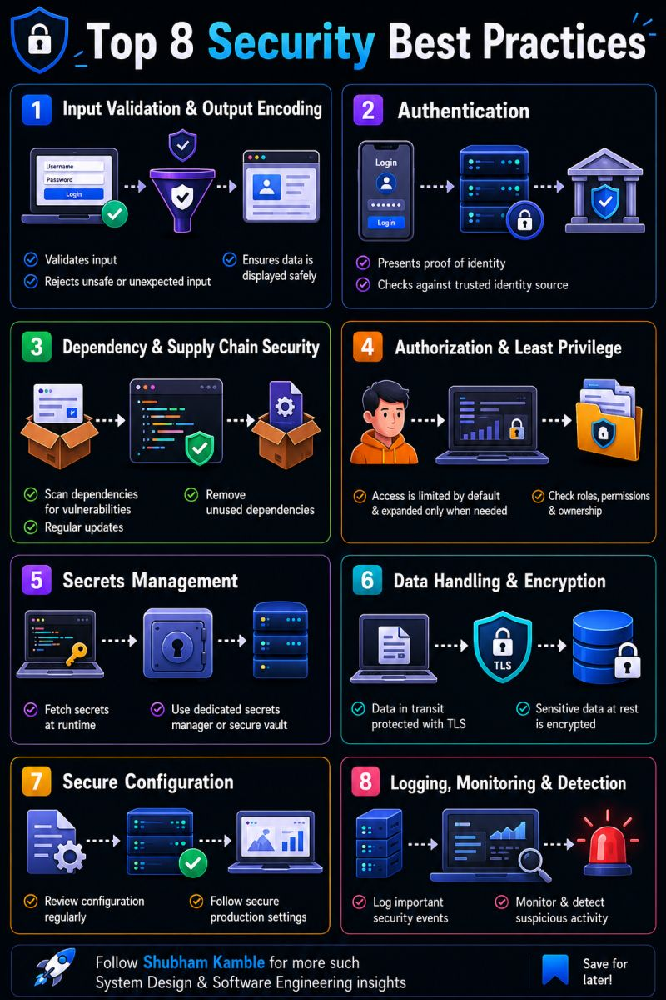

✅ Validate all user inputs

🔐 Use strong authentication & authorization

📦 Keep dependencies updated

🛡️ Follow the principle of least privilege

🔑 Store secrets in a secure vault, not in code

🔒 Encrypt data in transit (TLS) and at rest

⚙️ Secure your production configuration

📊 Log, monitor, and detect suspicious

