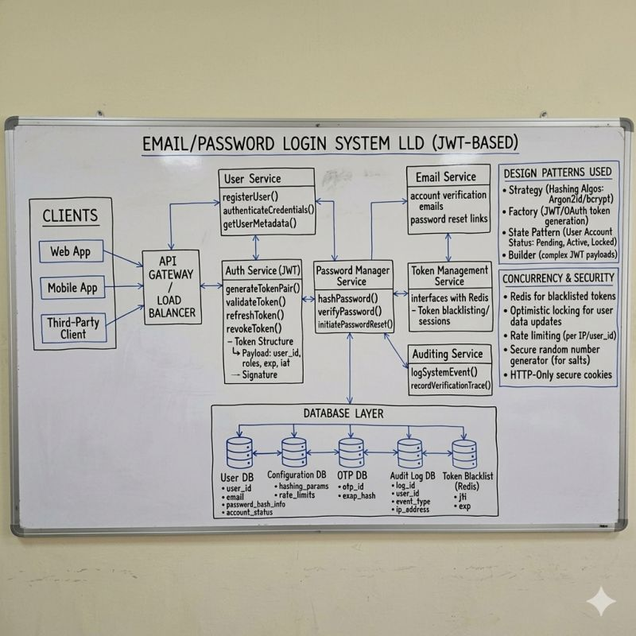

𝗬𝗼𝘂 𝗲𝗻𝘁𝗲𝗿 𝘆𝗼𝘂𝗿 𝗲𝗺𝗮𝗶𝗹 𝗮𝗻𝗱 𝗽𝗮𝘀𝘀𝘄𝗼𝗿𝗱… 𝗮𝗻𝗱 𝗯𝗼𝗼𝗺 𝘆𝗼𝘂’𝗿𝗲 𝗶𝗻, 𝗯𝘂𝘁 𝗯𝗲𝗵𝗶𝗻𝗱 𝘁𝗵𝗮𝘁 𝟮-𝘀𝗲𝗰𝗼𝗻𝗱 𝗹𝗼𝗴𝗶𝗻 𝗶𝘀 𝗮𝗻 𝗲𝗻𝘁𝗶𝗿𝗲 𝗮𝘂𝘁𝗵𝗲𝗻𝘁𝗶𝗰𝗮𝘁𝗶𝗼𝗻 𝘀𝘆𝘀𝘁𝗲𝗺 𝘄𝗼𝗿𝗸𝗶𝗻𝗴 𝗯𝗲𝗵𝗶𝗻𝗱 𝘁𝗵𝗲 𝘀𝗰𝗲𝗻𝗲𝘀...

I built a complete password-based authentication system and realized how much security happens in those 2 seconds.

𝗛𝗲𝗿𝗲'𝘀 𝘄𝗵𝗮𝘁 𝗵𝗮𝗽𝗽𝗲𝗻𝘀 𝘄𝗵𝗲𝗻 𝘆𝗼𝘂 𝗵𝗶𝘁 𝗟𝗼𝗴𝗶𝗻:

𝟭) 𝗣𝗮𝘀𝘀𝘄𝗼𝗿𝗱 𝗛𝗮𝘀𝗵𝗶𝗻𝗴
Your password never gets stored as plain text. The system runs it through bcrypt or Argon2, turning "password123" into an 𝘂𝗻𝗿𝗲𝗮𝗱𝗮𝗯𝗹𝗲 𝗵𝗮𝘀𝗵 that even the database admin can't reverse.

𝟮) 𝗦𝗮𝗹𝘁 𝗚𝗲𝗻𝗲𝗿𝗮𝘁𝗶𝗼𝗻
Each password gets 𝗮 𝘂𝗻𝗶𝗾𝘂𝗲 𝗿𝗮𝗻𝗱𝗼𝗺 𝘀𝗮𝗹𝘁 before hashing. This means two users with the same password end up with completely different hashes in the database.

𝟯) 𝗦𝗲𝗰𝘂𝗿𝗲 𝗖𝗼𝗺𝗽𝗮𝗿𝗶𝘀𝗼𝗻
When you log in, the 𝘀𝘆𝘀𝘁𝗲𝗺 𝗵𝗮𝘀𝗵𝗲𝘀 𝘆𝗼𝘂𝗿 𝗶𝗻𝗽𝘂𝘁 with the stored salt and compares it to the saved hash. Never storing or transmitting your actual password.

𝟰) 𝗥𝗮𝘁𝗲 𝗟𝗶𝗺𝗶𝘁𝗶𝗻𝗴
Try entering the wrong password 5 times? Your account gets temporarily locked. This prevents 𝗯𝗿𝘂𝘁𝗲 𝗳𝗼𝗿𝗰𝗲 𝗮𝘁𝘁𝗮𝗰𝗸𝘀 where hackers try thousands of password combinations.

𝟱)𝗝𝗪𝗧 𝗧𝗼𝗸𝗲𝗻 𝗚𝗲𝗻𝗲𝗿𝗮𝘁𝗶𝗼𝗻
After successful login, the backend creates a 𝗝𝗦𝗢𝗡 𝗪𝗲𝗯 𝗧𝗼𝗸𝗲𝗻 𝘀𝗶𝗴𝗻𝗲𝗱 𝘄𝗶𝘁𝗵 𝗮 𝘀𝗲𝗰𝗿𝗲𝘁 𝗸𝗲𝘆. This token proves you're authenticated without sending your password on every request.

𝟲) 𝗦𝗲𝗰𝘂𝗿𝗲 𝗦𝗲𝘀𝘀𝗶𝗼𝗻 𝗠𝗮𝗻𝗮𝗴𝗲𝗺𝗲𝗻𝘁
The JWT gets stored in 𝗵𝘁𝘁𝗽𝗢𝗻𝗹𝘆 𝗰𝗼𝗼𝗸𝗶𝗲𝘀, protecting it from XSS attacks. Your session stays secure even if malicious JavaScript runs on the page.

𝟳) 𝗛𝗧𝗧𝗣𝗦 𝗘𝗻𝗰𝗿𝘆𝗽𝘁𝗶𝗼𝗻
Everything travels over 𝗦𝗦𝗟/𝗧𝗟𝗦 𝗲𝗻𝗰𝗿𝘆𝗽𝘁𝗶𝗼𝗻. Even if someone intercepts the network traffic, they can't read your password or steal your session.

𝗠𝗼𝘀𝘁 𝗱𝗲𝘃𝗲𝗹𝗼𝗽𝗲𝗿𝘀 𝗴𝗲𝘁 𝘁𝗵𝗶𝘀 𝗽𝗮𝗿𝘁 𝘄𝗿𝗼𝗻𝗴: 𝗝𝗪𝗧 + 𝗡𝗲𝘅𝘁.𝗷𝘀

Using JWT is easy.
Using it securely is where THINGS BREAK!!

𝗧𝗵𝗶𝘀 𝗺𝗮𝘁𝘁𝗲𝗿𝘀:
• 𝗡𝗲𝘃𝗲𝗿 𝘀𝘁𝗼𝗿𝗲 𝗝𝗪𝗧 𝗶𝗻 𝗹𝗼𝗰𝗮𝗹𝗦𝘁𝗼𝗿𝗮𝗴𝗲 → XSS = game over
• Use httpOnly cookies so JavaScript can’t access tokens
• Keep access 𝘁𝗼𝗸𝗲𝗻𝘀 𝘀𝗵𝗼𝗿𝘁-𝗹𝗶𝘃𝗲𝗱 (𝟭𝟱–𝟯𝟬 𝗺𝗶𝗻𝘀)
• Use refresh tokens to silently re-authenticate users
• Store 𝗿𝗲𝗳𝗿𝗲𝘀𝗵 𝘁𝗼𝗸𝗲𝗻𝘀 securely (DB or rotated tokens)
• Always 𝘃𝗮𝗹𝗶𝗱𝗮𝘁𝗲 𝘁𝗼𝗸𝗲𝗻𝘀 𝗼𝗻 𝘁𝗵𝗲 𝘀𝗲𝗿𝘃𝗲𝗿 (not just frontend)

𝗧𝗵𝗮𝘁 𝘀𝗶𝗺𝗽𝗹𝗲 𝗹𝗼𝗴𝗶𝗻 𝗳𝗼𝗿𝗺 𝗶𝘀 𝗽𝗿𝗼𝘁𝗲𝗰𝘁𝗶𝗻𝗴 𝗮𝗴𝗮𝗶𝗻𝘀𝘁 :
 • password leaks,
 • brute force attacks,
 • session hijacking,
 • man-in-the-middle attacks all at once.

𝗡𝗲𝘅𝘁 𝘁𝗶𝗺𝗲 𝘆𝗼𝘂 𝗵𝗶𝘁 “𝗟𝗼𝗴𝗶𝗻”… 𝗿𝗲𝗺𝗲𝗺𝗯𝗲𝗿, 𝗶𝘁’𝘀 𝗻𝗼𝘁 𝗷𝘂𝘀𝘁 𝗮 𝗳𝗼𝗿𝗺. 𝗜𝘁’𝘀 𝗮 𝗳𝘂𝗹𝗹-𝗯𝗹𝗼𝘄𝗻 𝘀𝗲𝗰𝘂𝗿𝗶𝘁𝘆 𝘀𝘆𝘀𝘁𝗲𝗺!!!

