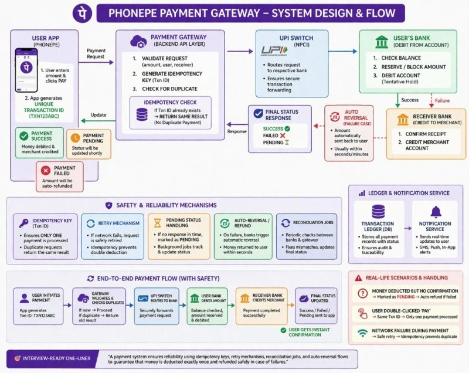

We use UPI apps every day. Scan. Pay. Done.

But what actually happens in those few seconds?

Let me explain this with a different analogy — something we all can relate to.

Imagine you are at a restaurant.

You place an order, but instead of paying immediately, you tell the waiter:
“I’ll pay digitally.”

Now here’s how the system works behind the scenes.

You (customer) → give payment request
Waiter → acts like your payment app
Restaurant manager → acts like the payment gateway
Kitchen → represents the bank systems

You tell the waiter:
“I want to pay ₹500.”

The waiter doesn’t directly handle money.
He takes your request to the manager.

Now the manager checks everything:
Is the table correct?
Is the amount valid?
Has this request already been made before?

(This is where duplicate prevention happens.)

Once validated, the manager sends the request to the kitchen.

Now the kitchen checks:
Does this customer actually have the balance?
If yes, it starts preparing the “payment”.

At the same time, another signal goes to the cashier (receiver side):
“Be ready to accept ₹500.”

If everything goes smoothly:
Food is prepared → payment is processed → cashier receives the money.

And within seconds, you get confirmation:
“Payment Successful.”

Now let’s talk about real-life edge cases.

Case 1: You pressed “Pay” twice
The manager recognizes it’s the same request (same order ID)
→ Only one payment is processed

Case 2: Kitchen started preparing but something failed
→ The order is cancelled
→ Money is returned automatically

Case 3: You didn’t get confirmation
→ System marks it as “Pending”
→ Background checks ensure it either completes or refunds

So even if things go wrong,
the system is designed to fix itself.

And all of this happens in just a few seconds.

That’s what makes payment systems powerful.

From outside, it feels like magic.
But inside, it’s a carefully designed flow with checks at every step.

Next time you scan and pay,
just remember — you’re not just making a payment.

You’re triggering a full system working end-to-end in milliseconds.

